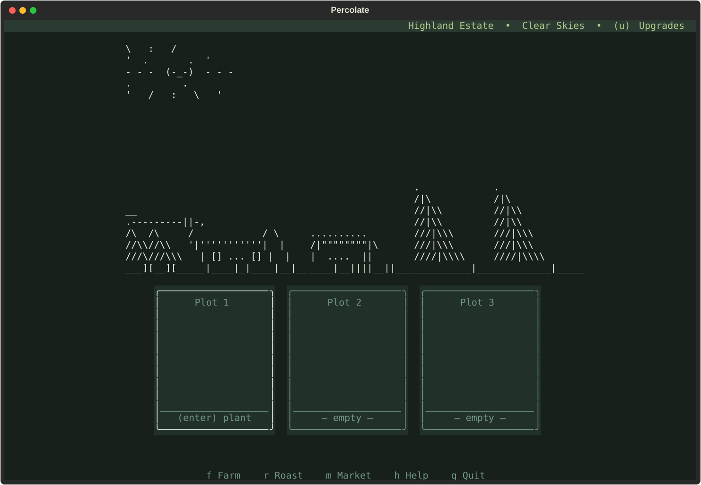
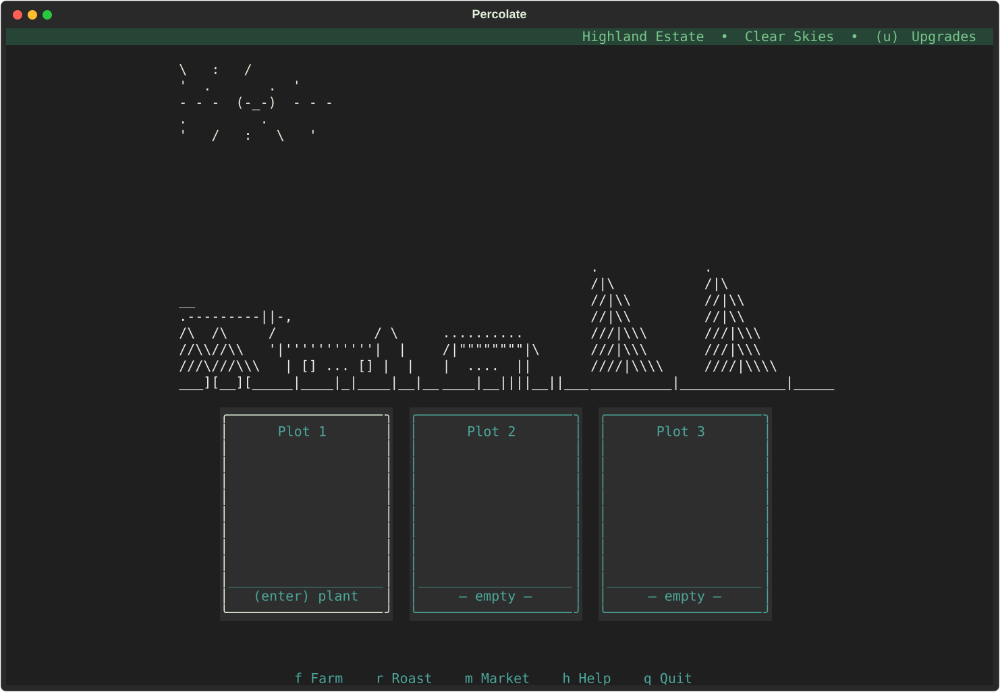
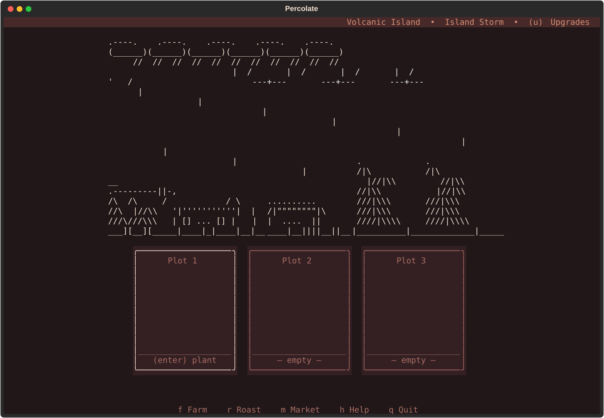
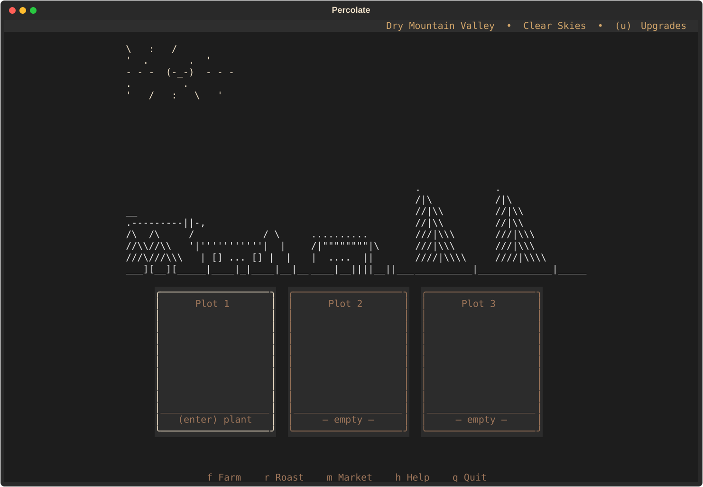

# Percolate


Percolate is a cozy, low-attention coffee farm and roastery that lives in your terminal. Plant beans, let them grow while you go about your day, harvest and roast them into your own named coffee blends, sell them at the market, and watch your farm grow along the way as you progress!

There's no clock to race and nothing to lose by walking away. Nothing decays, nothing punishes you for stepping away, and there's no urgency: check in for a minute between tasks, or come back in three days — either way, it's exactly as ready as when you left it.

## Download and run

Grab the latest build for your OS from the [Releases](../../releases) page — no Python install required. Each release is a single self-contained executable, `percolate` (`percolate.exe` on Windows); no extraction needed, just download and run it.

## Controls

| Key | Action |
| --- | --- |
| `f` | Farm screen |
| `r` | Roast screen |
| `m` | Market screen |
| `h` | Help |
| `q` | Quit (saves automatically) |

Control hints are shown inline, next to whatever they act on — e.g. the selected plot shows `(enter) plant`, a finished roast shows `(c)`, and the Farm and Roasting screens show `(u) Upgrades`. `u` opens a contextual upgrade shop for that screen (Farm Upgrades vs. Roaster Upgrades). On the Market screen, Tab moves focus between the four buy/sell lists and Enter acts on the highlighted row. On the Roast screen, Tab or left/right moves between Bean, Flavor, and Roast Level; up/down moves within a list and Enter confirms a choice.

Progress is saved to `~/.config/percolate/state.json` after every action.

## The loop

1. **Buy seeds** at the Market with starting gold.
2. **Plant and grow** them on the Farm screen — Caturra is ready in about 30 minutes, while later varieties support longer check-ins and overnight growing.
3. **Harvest and sell raw beans**, or roast them in the basic roaster you start with.
4. **Roast** harvested beans — choose a bean, optional flavor ingredients, and a roast level; Discover curated combinations and you'll earn a bonus over their base value.
5. **Sell roasted product** at the Market for more than raw beans, and reinvest in upgrades (more plots, faster growth, more roast slots, more flavor slots).

### Choose a home region

On a new game, choose one of four regions. The choice is saved with your game and sets both the farm's starting atmosphere and its gameplay modifiers:

| Region | Effect |
| --- | --- |
| Highland Estate | +5% growth, +4% quality |
| Tropical Lowland | +12% growth, -3% quality |
| Volcanic Island | +2% growth, +9% quality |
| Dry Mountain Valley | -6% growth, +12% quality |

The Farm screen uses a distinct palette for each region:

<table>
  <tr>
    <td align="center"><strong>Highland Estate</strong><br></td>
    <td align="center"><strong>Tropical Lowland</strong><br></td>
  </tr>
  <tr>
    <td align="center"><strong>Volcanic Island</strong><br></td>
    <td align="center"><strong>Dry Mountain Valley</strong><br></td>
  </tr>
</table>

Some bean varieties also prefer particular regions. For example, Bourbon grows faster in the Tropical Lowland, while Typica and Bourbon gain quality in the Highland Estate or Volcanic Island. The active region changes the Farm palette automatically.

Bean varieties are inspired by real coffee cultivars and species. Typica, Caturra, Bourbon, and Yirgacheffe start available; Soil Quality unlocks Robusta; Plot Expansion unlocks Catimor and SL28; the first Roaster unlocks Geisha; and the first Infuser unlocks Liberica. Bean traits contribute to roast quality, and the catalog also carries yield, disease-resistance, and lineage data for future systems.

Reference design guide: [List of coffee varieties](https://en.wikipedia.org/wiki/List_of_coffee_varieties).

Your farmhouse backdrop on the Farm screen evolves automatically as you unlock plot expansions and other upgrades.

## Theme

Percolate ships two custom warm coffee-roastery color themes — `percolate-latte` (default, softer/lighter) and `percolate-mocha` (darker, more saturated). Both are dark themes — neither is a bright/light theme. The active region supplies a matching palette on startup. You can switch between the region palette, the two coffee themes, or any other built-in Textual theme from the command palette (`ctrl+p`).

## Progression

Upgrades are purchased from the contextual shop on the Farm or Roasting screen:

- **Plot Expansion** adds planting plots and unlocks Catimor and SL28.
- **Soil Quality** speeds up new plantings and unlocks Robusta.
- **Roaster** adds another simultaneous roast slot and unlocks Geisha at tier one.
- **Roaster Efficiency** shortens roast times.
- **Infuser** unlocks flavor ingredients, then increases the number of flavors allowed in a roast; its first tier unlocks Liberica.

Every bean, ingredient, and roast level combination is valid. Matching one of the curated recipes gives the product a special name and a value bonus; undiscovered recipes remain hidden in the Roasting screen's recipe log.

## Development

### Running from source

```bash
pip install -e .
percolate
```

or, without installing:

```bash
python -m percolate.main
```

### Running tests

Install the development dependencies and run the model tests with:

```bash
pip install -e ".[dev]"
python -m pytest
```

The test suite covers the UI-independent game rules: timed growth, plots,
buying and selling, roasting, recipes, upgrades, region modifiers, registries,
state persistence, themes, and smoke-level app behavior. The gameplay engine
uses a data-driven content catalog and an injectable clock, so rules can be
tested without depending on terminal size or wall-clock time.

To capture deterministic headless Farm screenshots for every location palette:

```bash
python tools/capture_location_screenshots.py /tmp/percolate-location-shots
```

### Dev mode

Set `PERCOLATE_DEV=1` before launching to enable testing shortcuts (off by default, no effect on real time):

| Key | Action |
| --- | --- |
| `[` | Skip forward 15 minutes |
| `]` | Skip forward 6 hours |
| `g` | +1000 gold |
| `l` / `Shift+L` | Next / previous location |
| `w` / `Shift+W` | Next / previous weather in the current location |

These rewind timer start times rather than touching the system clock, so they only affect Percolate's own state.

### Building a standalone executable

```bash
pip install -e ".[build]"
./build.sh      # Linux/WSL/macOS
.\build.ps1     # Windows
```

This is how the [Releases](../../releases) builds are produced. Nuitka can't cross-compile, so build on whichever OS you want an executable for. The `build.sh`/`build.ps1` wrapper compiles `percolate/main.py` with Nuitka in `--mode=onefile`, producing a single self-contained executable at `dist/<os>/percolate` (`percolate.exe` on Windows) — nothing else to ship. Unlike PyInstaller, Nuitka compiles through a real C compiler, so building requires one to be installed; Nuitka can also fetch its own (e.g. via the `ziglang` PyPI package) if none is found on the system.

On first launch, the executable unpacks its bundled data/CSS/runtime into a per-version cache directory and reuses it on later launches (rather than re-unpacking every time) for faster repeated startup.

State still saves to `~/.config/percolate/state.json` (or the OS equivalent) regardless of how it was launched.
